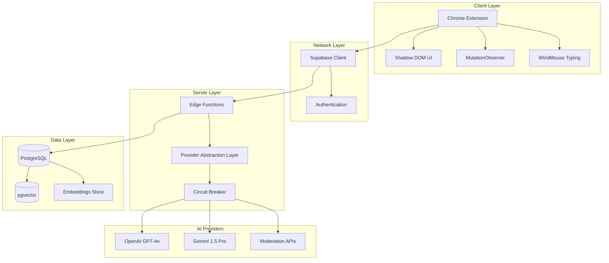

# Design Document: PostPhantom

## Overview

PostPhantom is a sophisticated LinkedIn content assistance system that combines AI-powered draft generation with strict human-in-the-loop governance. The system operates as a Chrome extension with Supabase Edge Functions backend, implementing a multi-provider AI strategy with OpenAI and Google Gemini while maintaining consistent embedding and moderation approaches.

The architecture follows a monorepo structure with clear separation between client-side sensing (Chrome Extension) and server-side intelligence (Edge Functions), connected through a Provider Abstraction Layer (PAL) that ensures consistent behavior across different AI providers.

**CRITICAL IMPLEMENTATION REQUIREMENT:** All third-party services (OpenAI API, Gemini API, Supabase, etc.) MUST use real accounts with actual credentials. No dummy data, mocking, or assumptions are permitted. Real API keys and production-ready configurations are required from the start.

## Architecture

### High-Level Architecture



### Technology Stack

**Client-Side (Chrome Extension):**
- Framework: WXT (Web Extension Tools) v0.19+ with Vite 5
- UI: React 18 + Tailwind CSS v3.4 + Radix UI + shadcn/ui
- State: Zustand + TanStack Query v5
- Storage: Custom ChromeStorageAdapter for Supabase auth
- Typing: Custom WindMouse implementation

**Server-Side (Edge Functions):**
- Runtime: Deno (Supabase Edge Runtime)
- AI Orchestration: LangChain.js via esm.sh
- Validation: Zod for structured outputs
- Dependencies: import_map.json with esm.sh URLs

**Data Layer:**
- Database: PostgreSQL 15+ with pgvector extension
- Authentication: Supabase Auth
- Vector Storage: HNSW indexes for embedding similarity

## Components and Interfaces

### Provider Abstraction Layer (PAL)

The PAL implements a unified interface for all AI providers, ensuring consistent behavior and easy provider switching.

```typescript
interface IGenerativeModel {
  generate(request: GenerationRequest): Promise<GenerationResponse>
  stream(request: GenerationRequest): Promise<ReadableStream> // MAY throw NotSupportedError for Gemini tool-calling
  getProviderName(): string
  getCapabilities(): ProviderCapabilities
}

interface GenerationRequest {
  messages: Message[]
  maxTokens?: number
  temperature?: number
  images?: ImageInput[]
  systemInstruction?: string
}

interface GenerationResponse {
  content: string
  provider: string
  tokensUsed: number
  safetyRatings?: SafetyRating[]
  finishReason: string
}
```

### Provider Implementations

**OpenAI Adapter:**
```typescript
class OpenAIAdapter implements IGenerativeModel {
  async generate(request: GenerationRequest): Promise<GenerationResponse> {
    // Convert to OpenAI format
    // Apply OpenAI Moderation API
    // Return standardized response
  }
  
  getCapabilities(): ProviderCapabilities {
    return {
      textGeneration: true,
      visionAnalysis: true,
      embeddings: true,
      maxContextTokens: 128000,
      supportedImageFormats: ['jpeg', 'png'] // LinkedIn standard formats only
    }
  }
}
```

**Gemini Adapter:**
```typescript
class GeminiAdapter implements IGenerativeModel {
  async generate(request: GenerationRequest): Promise<GenerationResponse> {
    // Map SystemMessage → systemInstruction
    // Map HumanMessage → user, AIMessage → model
    // Convert images → inlineData (≤10MB)
    // Apply BLOCK_ONLY_HIGH safety settings
    // Return standardized response
  }
  
  getCapabilities(): ProviderCapabilities {
    return {
      textGeneration: true,
      visionAnalysis: true,
      embeddings: false, // Explicitly disabled
      maxContextTokens: 1000000,
      supportedImageFormats: ['jpeg', 'png'] // LinkedIn standard formats only
    }
  }
}
```

### Dynamic Routing Logic

```typescript
class ProviderRouter {
  selectProvider(request: GenerationRequest, userPreference?: string): string {
    // 1. Check circuit breaker health
    if (this.circuitBreaker.isUnhealthy('openai')) {
      return 'gemini'
    }
    if (this.circuitBreaker.isUnhealthy('gemini')) {
      return 'openai'
    }
    
    // 2. Explicit user preference
    if (userPreference && this.isProviderHealthy(userPreference)) {
      return userPreference
    }
    
    // 3. Token estimation routing
    const estimatedTokens = this.estimateTokens(request)
    if (estimatedTokens > 110000) {
      return 'gemini'
    }
    
    // 4. Video input routing (dashboard-uploaded or explicitly attached media only, not native LinkedIn embeds)
    if (this.hasVideoInput(request)) {
      return 'gemini'
    }
    
    // 5. Default to OpenAI
    return 'openai'
  }
  
  private estimateTokens(request: GenerationRequest): number {
    const totalChars = request.messages
      .map(m => m.content.length)
      .reduce((sum, len) => sum + len, 0)
    return Math.ceil(totalChars / 4) // Heuristic: chars/4
  }
}
```

### Circuit Breaker Implementation

```typescript
class CircuitBreaker {
  private providerHealth = new Map<string, ProviderHealth>()
  
  async executeWithFailover<T>(
    primaryProvider: string,
    secondaryProvider: string,
    operation: (provider: string) => Promise<T>
  ): Promise<T> {
    try {
      const result = await operation(primaryProvider)
      this.recordSuccess(primaryProvider)
      return result
    } catch (error) {
      console.warn(`Primary provider ${primaryProvider} failed:`, error)
      
      try {
        const result = await operation(secondaryProvider)
        this.markUnhealthy(primaryProvider)
        return result
      } catch (secondaryError) {
        this.markUnhealthy(secondaryProvider)
        throw new Error('Both providers failed')
      }
    }
  }
  
  private markUnhealthy(provider: string): void {
    this.providerHealth.set(provider, {
      isHealthy: false,
      lastFailure: Date.now(),
      cooldownUntil: Date.now() + (5 * 60 * 1000) // 5 minute cooldown
    })
  }
}
```

### Chrome Extension Architecture

**Shadow DOM UI Injection:**
```typescript
class ShadowDOMInjector {
  createUI(targetElement: Element): ShadowRoot {
    const shadowRoot = targetElement.attachShadow({ mode: 'closed' })
    
    // Inject Tailwind CSS and component styles
    const styleSheet = new CSSStyleSheet()
    styleSheet.replaceSync(tailwindCSS + customStyles)
    shadowRoot.adoptedStyleSheets = [styleSheet]
    
    // Render React components inside shadow root
    const container = document.createElement('div')
    shadowRoot.appendChild(container)
    
    ReactDOM.render(<PostPhantomUI />, container)
    return shadowRoot
  }
}
```

**MutationObserver for SPA Detection:**
```typescript
class SPAObserver {
  private observer: MutationObserver
  
  startObserving(): void {
    this.observer = new MutationObserver((mutations) => {
      for (const mutation of mutations) {
        if (this.isLinkedInContentChange(mutation)) {
          this.reinjectUI()
        }
      }
    })
    
    this.observer.observe(document.body, {
      childList: true,
      subtree: true,
      attributes: true,
      attributeFilter: ['class', 'data-*']
    })
  }
}
```

### WindMouse Typing Simulation

```typescript
class WindMouseTyper {
  async typeText(text: string, targetElement: HTMLElement): Promise<void> {
    const chars = text.split('')
    
    for (let i = 0; i < chars.length; i++) {
      // Gaussian jitter for timing
      const baseDelay = 50 // ms
      const jitter = this.gaussianRandom(0, 15)
      const delay = Math.max(20, baseDelay + jitter)
      
      // Simulate keypress
      await this.simulateKeypress(chars[i], targetElement)
      await this.sleep(delay)
      
      // Occasional longer pauses (thinking)
      if (Math.random() < 0.05) {
        await this.sleep(this.gaussianRandom(200, 100))
      }
    }
  }
  
  private gaussianRandom(mean: number, stdDev: number): number {
    // Box-Muller transform for Gaussian distribution
    const u1 = Math.random()
    const u2 = Math.random()
    const z0 = Math.sqrt(-2 * Math.log(u1)) * Math.cos(2 * Math.PI * u2)
    return z0 * stdDev + mean
  }
}
```

## Data Models

### Core Database Schema

```sql
-- AI Model Registry
CREATE TABLE ai_model_registry (
  id UUID PRIMARY KEY DEFAULT gen_random_uuid(),
  provider_slug TEXT NOT NULL,
  model_name TEXT NOT NULL,
  context_window INTEGER NOT NULL,
  is_active BOOLEAN DEFAULT true,
  capabilities JSONB NOT NULL,
  created_at TIMESTAMPTZ DEFAULT NOW(),
  updated_at TIMESTAMPTZ DEFAULT NOW()
);

-- Request Logs (Enhanced)
CREATE TABLE request_logs (
  id UUID PRIMARY KEY DEFAULT gen_random_uuid(),
  user_id UUID REFERENCES auth.users(id),
  provider TEXT NOT NULL,
  model_name TEXT NOT NULL,
  estimated_tokens INTEGER,
  actual_tokens INTEGER,
  safety_ratings JSONB,
  request_type TEXT NOT NULL, -- 'generation', 'embedding', 'moderation'
  success BOOLEAN NOT NULL,
  error_message TEXT,
  response_time_ms INTEGER,
  created_at TIMESTAMPTZ DEFAULT NOW()
);

-- User Preferences
CREATE TABLE user_preferences (
  user_id UUID PRIMARY KEY REFERENCES auth.users(id),
  preferred_provider TEXT DEFAULT 'openai',
  generation_temperature DECIMAL(3,2) DEFAULT 0.7,
  max_drafts_per_request INTEGER DEFAULT 3,
  anti_cheerleader_enabled BOOLEAN DEFAULT true,
  typing_speed_multiplier DECIMAL(3,2) DEFAULT 1.0,
  preferences JSONB DEFAULT '{}',
  created_at TIMESTAMPTZ DEFAULT NOW(),
  updated_at TIMESTAMPTZ DEFAULT NOW()
);

-- Context Embeddings (No generated text ever stored)
CREATE TABLE context_embeddings (
  id UUID PRIMARY KEY DEFAULT gen_random_uuid(),
  user_id UUID REFERENCES auth.users(id),
  content_hash TEXT NOT NULL,
  content_type TEXT NOT NULL, -- 'interaction', 'contact', 'topic'
  embedding vector(1536), -- OpenAI text-embedding-3-small dimension
  metadata JSONB DEFAULT '{}', -- Metadata only, never user content or generated text
  created_at TIMESTAMPTZ DEFAULT NOW()
);

-- Create HNSW index for fast similarity search
CREATE INDEX ON context_embeddings USING hnsw (embedding vector_cosine_ops);

-- Rate Limiting
CREATE TABLE rate_limits (
  user_id UUID PRIMARY KEY REFERENCES auth.users(id),
  daily_count INTEGER DEFAULT 0,
  hourly_count INTEGER DEFAULT 0,
  last_request_at TIMESTAMPTZ,
  daily_reset_at TIMESTAMPTZ DEFAULT (CURRENT_DATE + INTERVAL '1 day'),
  hourly_reset_at TIMESTAMPTZ DEFAULT (date_trunc('hour', NOW()) + INTERVAL '1 hour'),
  is_locked BOOLEAN DEFAULT false,
  lock_expires_at TIMESTAMPTZ
);
```

### TypeScript Data Models

```typescript
interface UserPreferences {
  userId: string
  preferredProvider: 'openai' | 'gemini'
  generationTemperature: number
  maxDraftsPerRequest: number
  antiCheerleaderEnabled: boolean
  typingSpeedMultiplier: number
  preferences: Record<string, any>
}

interface RequestLog {
  id: string
  userId: string
  provider: string
  modelName: string
  estimatedTokens?: number
  actualTokens?: number
  safetyRatings?: SafetyRating[]
  requestType: 'generation' | 'embedding' | 'moderation'
  success: boolean
  errorMessage?: string
  responseTimeMs: number
  createdAt: Date
}

interface ContentEmbedding {
  id: string
  userId: string
  contentHash: string
  contentType: 'interaction' | 'contact' | 'topic'
  embedding: number[]
  metadata: Record<string, any> // Metadata only, never user content or generated text
  createdAt: Date
}

interface RateLimit {
  userId: string
  dailyCount: number
  hourlyCount: number
  lastRequestAt?: Date
  dailyResetAt: Date
  hourlyResetAt: Date
  isLocked: boolean
  lockExpiresAt?: Date
}
```

Now I need to use the prework tool to analyze the acceptance criteria before writing the Correctness Properties section:

<function_calls>
<invoke name="prework">
<parameter name="featureName">linkedin-ghostwriter

## Correctness Properties

*A property is a characteristic or behavior that should hold true across all valid executions of a system—essentially, a formal statement about what the system should do. Properties serve as the bridge between human-readable specifications and machine-verifiable correctness guarantees.*

### Property 1: Content Generation Consistency
*For any* valid generation request, the system should produce relevant drafts using the correctly selected AI provider based on routing rules
**Validates: Requirements 1.1, 1.3, 1.4**

### Property 2: Multi-Modal Input Support
*For any* generation request with or without images/video, the system should process the request successfully using appropriate provider capabilities
**Validates: Requirements 1.2, 2.2**

### Property 3: Multiple Draft Provision
*For any* successful generation request, the system should return multiple draft variations for user selection
**Validates: Requirements 1.5**

### Property 4: Provider Capabilities Consistency
*For any* AI provider in the system, it should successfully handle requests within its declared capabilities (text generation, vision analysis, embeddings)
**Validates: Requirements 2.1, 2.2**

### Property 5: Failover Reliability
*For any* provider failure scenario, the system should automatically failover to a healthy secondary provider and mark the failed provider as unhealthy
**Validates: Requirements 2.3, 2.4**

### Property 6: Embedding Model Consistency
*For any* embedding operation, the system should use OpenAI text-embedding-3-small exclusively, never using Gemini for embeddings
**Validates: Requirements 2.5**

### Property 7: Provider-Appropriate Safety Enforcement
*For any* generation request, the system should apply exactly one safety enforcement mechanism appropriate to the selected provider (OpenAI Moderation API or Gemini Safety Settings)
**Validates: Requirements 3.1, 3.2, 3.3**

### Property 8: Moderation Failure Handling
*For any* content that fails moderation, the system should reject the request and provide appropriate feedback without proceeding to generation
**Validates: Requirements 3.4**

### Property 9: Shadow DOM UI Isolation
*For any* UI element injected by the Chrome extension, it should be contained within a Shadow DOM to prevent styling conflicts with LinkedIn
**Validates: Requirements 4.1, 4.5**

### Property 10: SPA Change Detection
*For any* DOM changes in LinkedIn's single-page application, the MutationObserver should detect the changes and trigger appropriate UI re-injection
**Validates: Requirements 4.2**

### Property 11: Human-in-the-Loop Enforcement
*For any* generated draft, the system should require explicit user selection and never automatically post content or click the Post button
**Validates: Requirements 5.1, 5.3**

### Property 12: Draft Editability
*For any* selected draft, the user should be able to edit the content before posting
**Validates: Requirements 5.2**

### Property 13: Anti-Cheerleader Warning System
*For any* generic positive content detected, the system should display appropriate warnings to discourage low-value engagement
**Validates: Requirements 5.4**

### Property 14: State Machine Compliance
*For any* user interaction sequence, the system should follow the defined state machine: Idle → Scanning → Drafting → Review → Typing
**Validates: Requirements 5.5**

### Property 15: Comprehensive Rate Limiting
*For any* user, the system should enforce daily limits (50 generations), cooldown periods (2 minutes), and hourly lockouts (30 minutes after 10 requests/hour)
**Validates: Requirements 6.1, 6.2, 6.3**

### Property 16: Prohibited Action Prevention
*For any* attempt at automatic likes, bulk actions, or data export scraping, the system should block these actions
**Validates: Requirements 6.4**

### Property 17: Natural Typing Simulation
*For any* content insertion, the Chrome extension should simulate human typing patterns with Gaussian jitter, realistic dwell times, and natural speed variations using WindMouse algorithm
**Validates: Requirements 7.1, 7.2, 7.3, 7.4, 7.5**

### Property 18: Comprehensive Data Persistence
*For any* user data, the system should store preferences in PostgreSQL (JSONB), embeddings using pgvector extension, and maintain AI model registry with capabilities
**Validates: Requirements 8.1, 8.2, 8.4**

### Property 19: Secure Authentication
*For any* data access operation, the system should use Supabase authentication for secure access control
**Validates: Requirements 8.5**

### Property 20: Provider Abstraction Interface Consistency
*For any* AI provider implementation, it should conform to the common IGenerativeModel interface and handle provider-specific conversions without exposing SDKs directly
**Validates: Requirements 9.1, 9.2, 9.5**

### Property 21: Gemini Message Format Conversion
*For any* Gemini request, the Provider Abstraction Layer should correctly map SystemMessage to systemInstruction and other message formats appropriately
**Validates: Requirements 9.3**

### Property 22: Image Size Validation
*For any* image processing request, the system should enforce 10MB size limits and reject oversized images
**Validates: Requirements 9.4**

### Property 23: Long Operation UI Feedback
*For any* large context processing operation, the system should display "Thinking..." UI feedback to inform users of ongoing processing
**Validates: Requirements 10.2**

### Property 24: Circuit Breaker Implementation
*For any* provider health monitoring scenario, the system should implement circuit breaker patterns and automatically recover unhealthy providers after cooldown periods
**Validates: Requirements 10.3, 10.4**

### Property 25: Metadata-Only Logging
*For any* system operation requiring logging (moderation, requests, compliance), the system should log only metadata (timestamps, provider, outcomes, safety categories) without storing user content or generated text
**Validates: Requirements 3.5, 6.5, 8.3, 10.5**

## Error Handling

### Provider Failure Scenarios

**Circuit Breaker States:**
- **Closed**: Normal operation, requests flow through
- **Open**: Provider marked unhealthy, requests routed to secondary
- **Half-Open**: Testing recovery, limited requests allowed

**Failure Response Strategy:**
```typescript
class ErrorHandler {
  async handleProviderError(error: ProviderError, context: RequestContext): Promise<ErrorResponse> {
    switch (error.type) {
      case 'RATE_LIMIT_EXCEEDED':
        return this.handleRateLimit(error, context)
      case 'MODERATION_FAILED':
        return this.handleModerationFailure(error, context)
      case 'PROVIDER_UNAVAILABLE':
        return this.handleProviderFailure(error, context)
      case 'INVALID_INPUT':
        return this.handleValidationError(error, context)
      default:
        return this.handleUnknownError(error, context)
    }
  }
}
```

### Rate Limiting Error Responses

**Daily Limit Exceeded:**
```json
{
  "error": "DAILY_LIMIT_EXCEEDED",
  "message": "You've reached your daily limit of 50 generations. Limit resets at midnight.",
  "resetAt": "2024-01-13T00:00:00Z",
  "remainingGenerations": 0
}
```

**Cooldown Period Active:**
```json
{
  "error": "COOLDOWN_ACTIVE",
  "message": "Please wait 2 minutes between requests.",
  "cooldownExpiresAt": "2024-01-12T15:32:00Z",
  "remainingSeconds": 87
}
```

### Moderation Failure Handling

**Content Rejected:**
```typescript
interface ModerationFailure {
  error: 'CONTENT_MODERATED'
  message: string
  categories: string[]
  provider: 'openai' | 'gemini'
  canRetry: boolean
  suggestions?: string[]
}
```

### Chrome Extension Error Recovery

**Shadow DOM Injection Failure:**
```typescript
class UIErrorRecovery {
  async recoverFromInjectionFailure(targetElement: Element): Promise<void> {
    // Retry Shadow DOM injection with different strategies
    const strategies = [
      () => this.injectWithShadowDOM(targetElement),
      () => this.retryWithDifferentTarget(targetElement),
      () => this.injectWithReducedFeatures(targetElement)
    ]
    
    for (const strategy of strategies) {
      try {
        await strategy()
        return
      } catch (error) {
        console.warn('Shadow DOM injection strategy failed:', error)
      }
    }
    
    // All Shadow DOM strategies failed - disable UI and notify user
    this.disableUI()
    this.notifyUserOfUIFailure()
    throw new Error('Shadow DOM injection failed - UI disabled for LinkedIn safety')
  }
}
```

## Testing Strategy

### Dual Testing Approach

PostPhantom employs both unit testing and property-based testing to ensure comprehensive coverage:

**Unit Tests:**
- Verify specific examples and edge cases
- Test integration points between components
- Validate error conditions and boundary cases
- Focus on concrete scenarios with known inputs/outputs

**Property-Based Tests:**
- Verify universal properties across all inputs
- Test system behavior with randomized inputs
- Ensure correctness properties hold for large input spaces
- Complement unit tests with comprehensive input coverage

### Property-Based Testing Configuration

**Testing Framework:** fast-check (JavaScript/TypeScript property-based testing library)

**Test Configuration:**
- Minimum 100 iterations per property test
- Each property test references its design document property
- Tag format: **Feature: linkedin-ghostwriter, Property {number}: {property_text}**

**Example Property Test Structure:**
```typescript
import fc from 'fast-check'

describe('PostPhantom Correctness Properties', () => {
  test('Property 1: Content Generation Consistency', async () => {
    await fc.assert(fc.asyncProperty(
      fc.record({
        messages: fc.array(fc.string(), { minLength: 1 }),
        maxTokens: fc.integer({ min: 1, max: 4000 }),
        temperature: fc.float({ min: 0, max: 2 })
      }),
      async (request) => {
        const response = await postPhantom.generate(request)
        
        // Property: Should always produce drafts with correct provider
        expect(response.drafts).toHaveLength.greaterThan(0)
        expect(response.provider).toMatch(/^(openai|gemini)$/)
        expect(response.drafts.every(draft => draft.content.length > 0)).toBe(true)
      }
    ), { numRuns: 100 })
  })
  
  // **Feature: linkedin-ghostwriter, Property 1: Content Generation Consistency**
})
```

### Unit Testing Focus Areas

**Provider Abstraction Layer:**
```typescript
describe('Provider Abstraction Layer', () => {
  test('should convert OpenAI messages correctly', () => {
    const messages = [
      { role: 'system', content: 'You are a helpful assistant' },
      { role: 'user', content: 'Hello' }
    ]
    
    const converted = openaiAdapter.convertMessages(messages)
    expect(converted).toEqual(expectedOpenAIFormat)
  })
  
  test('should apply OpenAI moderation', async () => {
    const request = { content: 'Test content' }
    const spy = jest.spyOn(openaiClient, 'moderations')
    
    await openaiAdapter.generate(request)
    expect(spy).toHaveBeenCalledWith({ input: 'Test content' })
  })
})
```

**Chrome Extension Integration:**
```typescript
describe('Chrome Extension', () => {
  test('should inject Shadow DOM UI', () => {
    const targetElement = document.createElement('div')
    const shadowRoot = injector.createUI(targetElement)
    
    expect(targetElement.shadowRoot).toBeTruthy()
    expect(shadowRoot.adoptedStyleSheets).toHaveLength.greaterThan(0)
  })
  
  test('should detect LinkedIn SPA changes', (done) => {
    const observer = new SPAObserver()
    observer.startObserving()
    
    observer.onContentChange = () => {
      expect(true).toBe(true) // Change detected
      done()
    }
    
    // Simulate LinkedIn content change
    document.body.innerHTML = '<div class="feed-container">New content</div>'
  })
})
```

### Integration Testing

**End-to-End Property Validation:**
```typescript
describe('Integration Tests', () => {
  test('complete generation workflow', async () => {
    // Test the full pipeline: request → routing → generation → response
    const request = createTestRequest()
    const response = await postPhantom.processRequest(request)
    
    expect(response.success).toBe(true)
    expect(response.drafts).toHaveLength.greaterThanOrEqual(1)
    expect(response.metadata.provider).toBeDefined()
    expect(response.metadata.safetyRatings).toBeDefined()
  })
})
```

### Performance Testing

**Load Testing:**
- Test rate limiting enforcement under high load
- Verify circuit breaker behavior during provider outages
- Measure response times for different content sizes

**Memory Testing:**
- Ensure Chrome extension doesn't leak memory during long sessions
- Verify proper cleanup of Shadow DOM elements
- Test embedding storage and retrieval performance

This comprehensive testing strategy ensures that PostPhantom maintains correctness, performance, and reliability across all operational scenarios while providing clear validation of the system's core properties.