# PostPhantom Database Design Specification

**Version:** 1.1  
**Date:** January 12, 2026  
**Product:** PostPhantom - Your Invisible Voice on LinkedIn  
**Architecture:** Principal Database Architect Specification  

---

## Change Log (v1.0 → v1.1)

### 🔒 MANDATORY COMPLIANCE FIXES
- **NEW TABLE:** `generation_sessions` - Structural HITL enforcement at database level
- **MODIFIED:** `request_logs` - Added vision tracking and draft multiplicity
- **NEW SECTION:** Non-Goals & Forbidden Data - Legal protection guarantees
- **ENHANCED:** Session message pruning with explicit retention rules
- **CLARIFIED:** `usage_analytics` scope as derived-only table
- **STRENGTHENED:** All enforcement moved from policy-only to defense-in-depth

### 🎯 Core Compliance Achievements
- ✅ Human-in-the-Loop structurally enforced (cannot be bypassed)
- ✅ Draft multiplicity fully auditable
- ✅ Vision/modality usage comprehensively tracked
- ✅ Content storage impossible by design
- ✅ All enforcement defense-in-depth, not policy-only  

---

## 1. Database Overview

### Purpose
PostPhantom is a LinkedIn content assistance system providing AI-powered draft generation with **structurally enforced** human-in-the-loop governance. The database **prevents** AI content insertion without explicit user review through schema-level constraints, supports Chrome extension UI injection, web dashboard analytics, multi-provider AI routing (OpenAI + Gemini), personal CRM capabilities, and comprehensive safety enforcement.

### Hosting Assumptions
- **Platform:** Supabase Edge + PostgreSQL 15+
- **Extensions:** pgvector for embeddings, uuid-ossp for UUID generation
- **Authentication:** Supabase Auth with Row Level Security (RLS)
- **Realtime:** Selective subscription for dashboard updates only
- **Edge Functions:** Deno runtime with service role access

### Compliance Posture
- **Privacy-First:** No raw user content or generated text stored (structurally impossible)
- **Metadata-Only Logging:** Audit trails without content exposure
- **Human-in-the-Loop:** Database **structurally enforces** review requirements via `generation_sessions`
- **Safety Enforcement:** Provider-appropriate moderation tracking with vision/modality auditing
- **Rate Limiting:** Strict usage controls with lockout mechanisms
- **Defense-in-Depth:** All enforcement via schema constraints, not policy-only

---

## Non-Goals & Forbidden Data

**LEGAL PROTECTION GUARANTEE:** The following data types are **structurally impossible** to store in this database:

### ❌ FORBIDDEN DATA (Cannot Be Stored)
- **Raw user input text** - Only hashes and metadata stored
- **Generated output text** - Only generation metadata and approval status stored  
- **Prompt storage** - Only request metadata without content
- **LinkedIn DOM content** - Only interaction hashes and metadata
- **Private messages** - Only message metadata without content
- **User personal information** - Only hashed identifiers and preferences
- **Content embeddings of user text** - Only embeddings of summaries/metadata

### 🔒 STRUCTURAL ENFORCEMENT
- All content fields use `content_hash TEXT` instead of `content TEXT`
- All user input uses `input_hash TEXT` instead of `input_content TEXT`
- All AI outputs tracked via `generation_sessions` approval flow, never stored
- All embeddings reference metadata summaries, never raw content
- All message tracking uses `message_hash TEXT` without message content

This design makes content storage **impossible by schema design**, not just policy.

---

## 2. Entity Relationship Diagram (ERD)

```mermaid
erDiagram
    %% Identity & User Configuration Domain
    auth_users ||--|| user_profiles : "1:1"
    auth_users ||--|| user_preferences : "1:1"
    auth_users ||--|| rate_limits : "1:1"
    auth_users ||--|| subscription_plans : "1:1"
    auth_users ||--o{ onboarding_progress : "1:many"
    
    %% Assets & Voice Intelligence Domain
    auth_users ||--o{ voice_personas : "1:many"
    auth_users ||--o{ content_templates : "1:many"
    voice_personas ||--o{ persona_embeddings : "1:many"
    content_templates ||--o{ template_variables : "1:many"
    auth_users ||--o{ asset_sync_state : "1:many"
    
    %% Personal CRM Domain
    auth_users ||--o{ crm_contacts : "1:many"
    auth_users ||--o{ crm_interactions : "1:many"
    auth_users ||--o{ crm_topics : "1:many"
    crm_contacts ||--o{ contact_embeddings : "1:many"
    crm_interactions ||--o{ interaction_embeddings : "1:many"
    crm_topics ||--o{ topic_embeddings : "1:many"
    crm_contacts ||--o{ contact_topic_relations : "1:many"
    crm_topics ||--o{ contact_topic_relations : "1:many"
    
    %% AI Execution & Routing Domain
    ai_model_registry ||--o{ request_logs : "1:many"
    auth_users ||--o{ request_logs : "1:many"
    auth_users ||--o{ generation_sessions : "1:many"
    request_logs ||--|| generation_sessions : "1:1"
    ai_model_registry ||--o{ provider_health : "1:many"
    auth_users ||--o{ routing_decisions : "1:many"
    
    %% Safety & Governance Domain
    auth_users ||--o{ moderation_decisions : "1:many"
    auth_users ||--o{ safety_flags : "1:many"
    auth_users ||--o{ hitl_enforcement : "1:many"
    auth_users ||--o{ duplicate_detection : "1:many"
    
    %% Copilot & Session State Domain
    auth_users ||--o{ copilot_sessions : "1:many"
    copilot_sessions ||--o{ session_messages : "1:many"
    auth_users ||--o{ sidebar_state : "1:many"
    
    %% Core Tables Detail
    auth_users {
        uuid id PK
        string email
        timestamptz created_at
        timestamptz updated_at
    }
    
    user_profiles {
        uuid user_id PK,FK
        string full_name
        string linkedin_profile_url
        jsonb profile_metadata
        timestamptz created_at
        timestamptz updated_at
    }
    
    user_preferences {
        uuid user_id PK,FK
        string preferred_provider
        decimal generation_temperature
        integer max_drafts_per_request
        boolean anti_cheerleader_enabled
        decimal typing_speed_multiplier
        jsonb preferences
        timestamptz created_at
        timestamptz updated_at
    }
    
    ai_model_registry {
        uuid id PK
        string provider_slug
        string model_name
        integer context_window
        boolean is_active
        jsonb capabilities
        timestamptz created_at
        timestamptz updated_at
    }
    
    request_logs {
        uuid id PK
        uuid user_id FK
        string provider
        string model_name
        integer estimated_tokens
        integer actual_tokens
        jsonb safety_ratings
        string request_type
        boolean success
        string error_message
        integer response_time_ms
        boolean used_vision
        jsonb input_modalities
        timestamptz created_at
    }
    
    generation_sessions {
        uuid id PK
        uuid user_id FK
        uuid request_id FK
        integer draft_count
        boolean review_required
        timestamptz review_completed_at
        integer approved_draft_index
        timestamptz inserted_at
        timestamptz created_at
    }
    
    context_embeddings {
        uuid id PK
        uuid user_id FK
        string content_hash
        string content_type
        vector embedding
        jsonb metadata
        timestamptz created_at
    }
    
    rate_limits {
        uuid user_id PK,FK
        integer daily_count
        integer hourly_count
        timestamptz last_request_at
        timestamptz daily_reset_at
        timestamptz hourly_reset_at
        boolean is_locked
        timestamptz lock_expires_at
    }
```



---

## 3. Domain A — Identity & User Configuration

### user_profiles
**Purpose:** Core user identity and LinkedIn profile association
```sql
CREATE TABLE user_profiles (
  user_id UUID PRIMARY KEY REFERENCES auth.users(id) ON DELETE CASCADE,
  full_name TEXT NOT NULL,
  linkedin_profile_url TEXT,
  profile_metadata JSONB DEFAULT '{}',
  created_at TIMESTAMPTZ DEFAULT NOW(),
  updated_at TIMESTAMPTZ DEFAULT NOW(),
  
  CONSTRAINT valid_linkedin_url CHECK (
    linkedin_profile_url IS NULL OR 
    linkedin_profile_url ~* '^https://www\.linkedin\.com/in/[a-zA-Z0-9\-]+/?$'
  )
);
```
**Rationale:** Links Supabase auth to LinkedIn identity without storing sensitive profile data.

### user_preferences
**Purpose:** AI generation preferences and UI behavior settings
```sql
CREATE TABLE user_preferences (
  user_id UUID PRIMARY KEY REFERENCES auth.users(id) ON DELETE CASCADE,
  preferred_provider TEXT DEFAULT 'openai',
  generation_temperature DECIMAL(3,2) DEFAULT 0.7,
  max_drafts_per_request INTEGER DEFAULT 3,
  anti_cheerleader_enabled BOOLEAN DEFAULT true,
  typing_speed_multiplier DECIMAL(3,2) DEFAULT 1.0,
  preferences JSONB DEFAULT '{}',
  created_at TIMESTAMPTZ DEFAULT NOW(),
  updated_at TIMESTAMPTZ DEFAULT NOW(),
  
  CONSTRAINT valid_preferred_provider CHECK (preferred_provider IN ('openai', 'gemini')),
  CONSTRAINT valid_temperature CHECK (generation_temperature >= 0 AND generation_temperature <= 2),
  CONSTRAINT valid_max_drafts CHECK (max_drafts_per_request >= 1 AND max_drafts_per_request <= 10),
  CONSTRAINT valid_typing_speed CHECK (typing_speed_multiplier >= 0.1 AND typing_speed_multiplier <= 5.0)
);
```
**Rationale:** Centralizes user customization for AI behavior and extension UI preferences.

### subscription_plans
**Purpose:** User plan limits and billing enforcement
```sql
CREATE TABLE subscription_plans (
  user_id UUID PRIMARY KEY REFERENCES auth.users(id) ON DELETE CASCADE,
  plan_type TEXT NOT NULL DEFAULT 'free',
  daily_generation_limit INTEGER DEFAULT 50,
  monthly_generation_limit INTEGER DEFAULT 1500,
  features_enabled JSONB DEFAULT '{}',
  plan_expires_at TIMESTAMPTZ,
  created_at TIMESTAMPTZ DEFAULT NOW(),
  updated_at TIMESTAMPTZ DEFAULT NOW(),
  
  CONSTRAINT valid_plan_type CHECK (plan_type IN ('free', 'pro', 'enterprise')),
  CONSTRAINT positive_limits CHECK (
    daily_generation_limit > 0 AND 
    monthly_generation_limit > 0
  )
);
```
**Rationale:** Enforces usage limits and feature access based on subscription tier.

### onboarding_progress
**Purpose:** Track user onboarding completion for UX flow
```sql
CREATE TABLE onboarding_progress (
  id UUID PRIMARY KEY DEFAULT gen_random_uuid(),
  user_id UUID REFERENCES auth.users(id) ON DELETE CASCADE,
  step_name TEXT NOT NULL,
  completed_at TIMESTAMPTZ DEFAULT NOW(),
  step_data JSONB DEFAULT '{}',
  
  CONSTRAINT valid_step_name CHECK (step_name IN (
    'welcome', 'linkedin_connect', 'voice_setup', 'first_generation', 'dashboard_tour'
  )),
  UNIQUE(user_id, step_name)
);
```
**Rationale:** Enables progressive onboarding and feature discovery tracking.

### extension_state_sync
**Purpose:** Synchronize Chrome extension state with web dashboard
```sql
CREATE TABLE extension_state_sync (
  user_id UUID PRIMARY KEY REFERENCES auth.users(id) ON DELETE CASCADE,
  extension_version TEXT,
  last_sync_at TIMESTAMPTZ DEFAULT NOW(),
  sync_data JSONB DEFAULT '{}',
  is_extension_active BOOLEAN DEFAULT false,
  
  CONSTRAINT valid_version_format CHECK (
    extension_version IS NULL OR 
    extension_version ~* '^\d+\.\d+\.\d+$'
  )
);
```
**Rationale:** Maintains consistency between extension and dashboard state.

---

## 4. Domain B — Assets & Voice Intelligence

### voice_personas
**Purpose:** User-defined voice personas for content generation
```sql
CREATE TABLE voice_personas (
  id UUID PRIMARY KEY DEFAULT gen_random_uuid(),
  user_id UUID REFERENCES auth.users(id) ON DELETE CASCADE,
  persona_name TEXT NOT NULL,
  persona_description TEXT NOT NULL,
  tone_attributes JSONB NOT NULL,
  example_phrases TEXT[],
  is_active BOOLEAN DEFAULT true,
  created_at TIMESTAMPTZ DEFAULT NOW(),
  updated_at TIMESTAMPTZ DEFAULT NOW(),
  
  CONSTRAINT non_empty_name CHECK (length(trim(persona_name)) > 0),
  CONSTRAINT non_empty_description CHECK (length(trim(persona_description)) > 0),
  UNIQUE(user_id, persona_name)
);
```
**Rationale:** Stores voice characteristics without raw prompts, enabling consistent persona-based generation.

### content_templates
**Purpose:** Reusable content templates with variable substitution
```sql
CREATE TABLE content_templates (
  id UUID PRIMARY KEY DEFAULT gen_random_uuid(),
  user_id UUID REFERENCES auth.users(id) ON DELETE CASCADE,
  template_name TEXT NOT NULL,
  template_structure TEXT NOT NULL,
  category TEXT NOT NULL,
  variable_schema JSONB DEFAULT '{}',
  usage_count INTEGER DEFAULT 0,
  is_active BOOLEAN DEFAULT true,
  created_at TIMESTAMPTZ DEFAULT NOW(),
  updated_at TIMESTAMPTZ DEFAULT NOW(),
  
  CONSTRAINT valid_category CHECK (category IN (
    'comment', 'post', 'message', 'connection_request'
  )),
  CONSTRAINT non_empty_template CHECK (length(trim(template_structure)) > 0),
  UNIQUE(user_id, template_name)
);
```
**Rationale:** Enables template-based generation without storing generated content.

### persona_embeddings
**Purpose:** Vector embeddings for persona similarity matching
```sql
CREATE TABLE persona_embeddings (
  id UUID PRIMARY KEY DEFAULT gen_random_uuid(),
  persona_id UUID REFERENCES voice_personas(id) ON DELETE CASCADE,
  embedding_hash TEXT NOT NULL,
  embedding vector(1536),
  metadata JSONB DEFAULT '{}',
  created_at TIMESTAMPTZ DEFAULT NOW(),
  
  CONSTRAINT non_empty_hash CHECK (length(embedding_hash) > 0)
);

CREATE INDEX idx_persona_embeddings_vector ON persona_embeddings 
USING hnsw (embedding vector_cosine_ops);
```
**Rationale:** Enables semantic persona matching using OpenAI embeddings exclusively.

### template_variables
**Purpose:** Dynamic variable definitions for template substitution
```sql
CREATE TABLE template_variables (
  id UUID PRIMARY KEY DEFAULT gen_random_uuid(),
  template_id UUID REFERENCES content_templates(id) ON DELETE CASCADE,
  variable_name TEXT NOT NULL,
  variable_type TEXT NOT NULL,
  default_value TEXT,
  validation_rules JSONB DEFAULT '{}',
  
  CONSTRAINT valid_variable_type CHECK (variable_type IN (
    'text', 'number', 'date', 'boolean', 'select'
  )),
  CONSTRAINT valid_variable_name CHECK (variable_name ~* '^[a-zA-Z][a-zA-Z0-9_]*$'),
  UNIQUE(template_id, variable_name)
);
```
**Rationale:** Supports dynamic template customization with type safety.

### asset_sync_state
**Purpose:** Track synchronization of assets between extension and dashboard
```sql
CREATE TABLE asset_sync_state (
  user_id UUID REFERENCES auth.users(id) ON DELETE CASCADE,
  asset_type TEXT NOT NULL,
  last_sync_at TIMESTAMPTZ DEFAULT NOW(),
  sync_version INTEGER DEFAULT 1,
  sync_status TEXT DEFAULT 'pending',
  
  CONSTRAINT valid_asset_type CHECK (asset_type IN (
    'personas', 'templates', 'preferences'
  )),
  CONSTRAINT valid_sync_status CHECK (sync_status IN (
    'pending', 'syncing', 'completed', 'failed'
  )),
  PRIMARY KEY(user_id, asset_type)
);
```
**Rationale:** Ensures asset consistency across client and web interfaces.

---

## 5. Domain C — Personal CRM (GraphRAG Memory)

### crm_contacts
**Purpose:** LinkedIn contact metadata without personal information
```sql
CREATE TABLE crm_contacts (
  id UUID PRIMARY KEY DEFAULT gen_random_uuid(),
  user_id UUID REFERENCES auth.users(id) ON DELETE CASCADE,
  contact_hash TEXT NOT NULL,
  contact_type TEXT NOT NULL,
  relationship_strength DECIMAL(3,2) DEFAULT 0.0,
  last_interaction_at TIMESTAMPTZ,
  interaction_count INTEGER DEFAULT 0,
  metadata JSONB DEFAULT '{}',
  created_at TIMESTAMPTZ DEFAULT NOW(),
  updated_at TIMESTAMPTZ DEFAULT NOW(),
  
  CONSTRAINT valid_contact_type CHECK (contact_type IN (
    'connection', 'follower', 'company', 'prospect'
  )),
  CONSTRAINT valid_relationship_strength CHECK (
    relationship_strength >= 0.0 AND relationship_strength <= 1.0
  ),
  CONSTRAINT non_empty_hash CHECK (length(contact_hash) > 0),
  UNIQUE(user_id, contact_hash)
);
```
**Rationale:** Tracks relationship metadata using hashes, never storing names or personal data.

### crm_interactions
**Purpose:** Interaction metadata for relationship scoring
```sql
CREATE TABLE crm_interactions (
  id UUID PRIMARY KEY DEFAULT gen_random_uuid(),
  user_id UUID REFERENCES auth.users(id) ON DELETE CASCADE,
  contact_id UUID REFERENCES crm_contacts(id) ON DELETE CASCADE,
  interaction_type TEXT NOT NULL,
  interaction_hash TEXT NOT NULL,
  sentiment_score DECIMAL(3,2),
  engagement_level TEXT,
  occurred_at TIMESTAMPTZ DEFAULT NOW(),
  metadata JSONB DEFAULT '{}',
  
  CONSTRAINT valid_interaction_type CHECK (interaction_type IN (
    'comment', 'like', 'share', 'message', 'connection', 'view'
  )),
  CONSTRAINT valid_sentiment_score CHECK (
    sentiment_score IS NULL OR 
    (sentiment_score >= -1.0 AND sentiment_score <= 1.0)
  ),
  CONSTRAINT valid_engagement_level CHECK (
    engagement_level IS NULL OR 
    engagement_level IN ('low', 'medium', 'high')
  ),
  CONSTRAINT non_empty_interaction_hash CHECK (length(interaction_hash) > 0)
);
```
**Rationale:** Captures interaction patterns for relationship intelligence without content storage.

### crm_topics
**Purpose:** Topic clustering for content relevance
```sql
CREATE TABLE crm_topics (
  id UUID PRIMARY KEY DEFAULT gen_random_uuid(),
  user_id UUID REFERENCES auth.users(id) ON DELETE CASCADE,
  topic_name TEXT NOT NULL,
  topic_hash TEXT NOT NULL,
  relevance_score DECIMAL(3,2) DEFAULT 0.0,
  mention_count INTEGER DEFAULT 0,
  last_mentioned_at TIMESTAMPTZ,
  metadata JSONB DEFAULT '{}',
  created_at TIMESTAMPTZ DEFAULT NOW(),
  
  CONSTRAINT valid_relevance_score CHECK (
    relevance_score >= 0.0 AND relevance_score <= 1.0
  ),
  CONSTRAINT non_empty_topic_name CHECK (length(trim(topic_name)) > 0),
  CONSTRAINT non_empty_topic_hash CHECK (length(topic_hash) > 0),
  UNIQUE(user_id, topic_hash)
);
```
**Rationale:** Enables topic-based content suggestions using semantic clustering.

### contact_embeddings
**Purpose:** Contact relationship embeddings for similarity
```sql
CREATE TABLE contact_embeddings (
  id UUID PRIMARY KEY DEFAULT gen_random_uuid(),
  contact_id UUID REFERENCES crm_contacts(id) ON DELETE CASCADE,
  embedding_hash TEXT NOT NULL,
  embedding vector(1536),
  embedding_type TEXT NOT NULL,
  metadata JSONB DEFAULT '{}',
  created_at TIMESTAMPTZ DEFAULT NOW(),
  
  CONSTRAINT valid_embedding_type CHECK (embedding_type IN (
    'profile', 'interaction_summary', 'topic_affinity'
  )),
  CONSTRAINT non_empty_embedding_hash CHECK (length(embedding_hash) > 0)
);

CREATE INDEX idx_contact_embeddings_vector ON contact_embeddings 
USING hnsw (embedding vector_cosine_ops);
```
**Rationale:** Enables semantic contact matching and relationship discovery.

### interaction_embeddings
**Purpose:** Interaction pattern embeddings for behavior analysis
```sql
CREATE TABLE interaction_embeddings (
  id UUID PRIMARY KEY DEFAULT gen_random_uuid(),
  interaction_id UUID REFERENCES crm_interactions(id) ON DELETE CASCADE,
  embedding_hash TEXT NOT NULL,
  embedding vector(1536),
  metadata JSONB DEFAULT '{}',
  created_at TIMESTAMPTZ DEFAULT NOW(),
  
  CONSTRAINT non_empty_embedding_hash CHECK (length(embedding_hash) > 0)
);

CREATE INDEX idx_interaction_embeddings_vector ON interaction_embeddings 
USING hnsw (embedding vector_cosine_ops);
```
**Rationale:** Captures interaction patterns for behavioral insights without content storage.

### topic_embeddings
**Purpose:** Topic semantic embeddings for content relevance
```sql
CREATE TABLE topic_embeddings (
  id UUID PRIMARY KEY DEFAULT gen_random_uuid(),
  topic_id UUID REFERENCES crm_topics(id) ON DELETE CASCADE,
  embedding_hash TEXT NOT NULL,
  embedding vector(1536),
  metadata JSONB DEFAULT '{}',
  created_at TIMESTAMPTZ DEFAULT NOW(),
  
  CONSTRAINT non_empty_embedding_hash CHECK (length(embedding_hash) > 0)
);

CREATE INDEX idx_topic_embeddings_vector ON topic_embeddings 
USING hnsw (embedding vector_cosine_ops);
```
**Rationale:** Enables topic-based content recommendations through semantic similarity.

### contact_topic_relations
**Purpose:** Graph relationships between contacts and topics
```sql
CREATE TABLE contact_topic_relations (
  id UUID PRIMARY KEY DEFAULT gen_random_uuid(),
  contact_id UUID REFERENCES crm_contacts(id) ON DELETE CASCADE,
  topic_id UUID REFERENCES crm_topics(id) ON DELETE CASCADE,
  relationship_strength DECIMAL(3,2) DEFAULT 0.0,
  relationship_type TEXT NOT NULL,
  created_at TIMESTAMPTZ DEFAULT NOW(),
  updated_at TIMESTAMPTZ DEFAULT NOW(),
  
  CONSTRAINT valid_relationship_strength CHECK (
    relationship_strength >= 0.0 AND relationship_strength <= 1.0
  ),
  CONSTRAINT valid_relationship_type CHECK (relationship_type IN (
    'mentions', 'expertise', 'interest', 'collaboration'
  )),
  UNIQUE(contact_id, topic_id, relationship_type)
);
```
**Rationale:** Creates GraphRAG-style knowledge graph for intelligent content suggestions.

---

## 6. Domain D — AI Execution & Routing

### ai_model_registry
**Purpose:** Available AI models and their capabilities
```sql
CREATE TABLE ai_model_registry (
  id UUID PRIMARY KEY DEFAULT gen_random_uuid(),
  provider_slug TEXT NOT NULL,
  model_name TEXT NOT NULL,
  context_window INTEGER NOT NULL,
  is_active BOOLEAN DEFAULT true,
  capabilities JSONB NOT NULL,
  cost_per_token DECIMAL(10,8),
  created_at TIMESTAMPTZ DEFAULT NOW(),
  updated_at TIMESTAMPTZ DEFAULT NOW(),
  
  CONSTRAINT unique_provider_model UNIQUE (provider_slug, model_name),
  CONSTRAINT valid_provider CHECK (provider_slug IN ('openai', 'gemini')),
  CONSTRAINT positive_context_window CHECK (context_window > 0),
  CONSTRAINT valid_cost CHECK (cost_per_token IS NULL OR cost_per_token >= 0)
);
```
**Rationale:** Central registry for AI model capabilities and routing decisions.

### provider_health
**Purpose:** Circuit breaker health monitoring for providers
```sql
CREATE TABLE provider_health (
  id UUID PRIMARY KEY DEFAULT gen_random_uuid(),
  provider_slug TEXT NOT NULL,
  model_name TEXT NOT NULL,
  is_healthy BOOLEAN DEFAULT true,
  failure_count INTEGER DEFAULT 0,
  last_failure_at TIMESTAMPTZ,
  last_success_at TIMESTAMPTZ,
  cooldown_until TIMESTAMPTZ,
  health_check_at TIMESTAMPTZ DEFAULT NOW(),
  
  CONSTRAINT valid_provider_health CHECK (provider_slug IN ('openai', 'gemini')),
  CONSTRAINT non_negative_failures CHECK (failure_count >= 0),
  UNIQUE(provider_slug, model_name)
);
```
**Rationale:** Implements circuit breaker pattern for provider reliability.

### routing_decisions
**Purpose:** AI provider routing decision audit trail
```sql
CREATE TABLE routing_decisions (
  id UUID PRIMARY KEY DEFAULT gen_random_uuid(),
  user_id UUID REFERENCES auth.users(id) ON DELETE CASCADE,
  request_hash TEXT NOT NULL,
  selected_provider TEXT NOT NULL,
  selected_model TEXT NOT NULL,
  routing_reason TEXT NOT NULL,
  estimated_tokens INTEGER,
  user_preference TEXT,
  provider_health_snapshot JSONB,
  created_at TIMESTAMPTZ DEFAULT NOW(),
  
  CONSTRAINT valid_selected_provider CHECK (selected_provider IN ('openai', 'gemini')),
  CONSTRAINT valid_routing_reason CHECK (routing_reason IN (
    'user_preference', 'token_limit', 'video_input', 'provider_health', 'default'
  )),
  CONSTRAINT non_empty_request_hash CHECK (length(request_hash) > 0)
);
```
**Rationale:** Audits routing decisions for debugging and optimization.

### request_logs
**Purpose:** Comprehensive AI request logging (metadata only)
```sql
CREATE TABLE request_logs (
  id UUID PRIMARY KEY DEFAULT gen_random_uuid(),
  user_id UUID REFERENCES auth.users(id) ON DELETE CASCADE,
  provider TEXT NOT NULL,
  model_name TEXT NOT NULL,
  estimated_tokens INTEGER,
  actual_tokens INTEGER,
  safety_ratings JSONB,
  request_type TEXT NOT NULL,
  success BOOLEAN NOT NULL,
  error_message TEXT,
  response_time_ms INTEGER,
  used_vision BOOLEAN DEFAULT false,
  input_modalities JSONB DEFAULT '{}',
  created_at TIMESTAMPTZ DEFAULT NOW(),
  
  CONSTRAINT valid_provider_logs CHECK (provider IN ('openai', 'gemini')),
  CONSTRAINT valid_request_type CHECK (request_type IN ('generation', 'embedding', 'moderation')),
  CONSTRAINT positive_tokens CHECK (estimated_tokens IS NULL OR estimated_tokens > 0),
  CONSTRAINT positive_actual_tokens CHECK (actual_tokens IS NULL OR actual_tokens > 0),
  CONSTRAINT positive_response_time CHECK (response_time_ms IS NULL OR response_time_ms >= 0)
);
```
**Rationale:** Comprehensive request auditing with vision/modality tracking without storing user content or generated text.

### generation_sessions
**Purpose:** Structural HITL enforcement - prevents AI content insertion without explicit user review
```sql
CREATE TABLE generation_sessions (
  id UUID PRIMARY KEY DEFAULT gen_random_uuid(),
  user_id UUID REFERENCES auth.users(id) ON DELETE CASCADE,
  request_id UUID REFERENCES request_logs(id) ON DELETE CASCADE,
  draft_count INTEGER NOT NULL,
  review_required BOOLEAN DEFAULT true,
  review_completed_at TIMESTAMPTZ,
  approved_draft_index INTEGER,
  inserted_at TIMESTAMPTZ,
  created_at TIMESTAMPTZ DEFAULT NOW(),
  
  CONSTRAINT positive_draft_count CHECK (draft_count > 0),
  CONSTRAINT valid_approved_draft CHECK (
    approved_draft_index IS NULL OR 
    (approved_draft_index >= 0 AND approved_draft_index < draft_count)
  ),
  CONSTRAINT hitl_enforcement CHECK (
    (review_required = true AND review_completed_at IS NULL AND approved_draft_index IS NULL AND inserted_at IS NULL) OR
    (review_required = false) OR
    (review_completed_at IS NOT NULL AND approved_draft_index IS NOT NULL)
  ),
  CONSTRAINT insertion_after_review CHECK (
    inserted_at IS NULL OR 
    (review_completed_at IS NOT NULL AND inserted_at >= review_completed_at)
  ),
  UNIQUE(request_id)
);
```
**Rationale:** **CRITICAL HITL ENFORCEMENT** - This table structurally prevents AI content from being inserted without explicit user review. The `hitl_enforcement` constraint ensures that content cannot be marked as inserted unless it has been reviewed and approved by the user. This provides defense-in-depth protection against accidental auto-posting.

---

## 7. Domain E — Safety, Moderation & Governance

### moderation_decisions
**Purpose:** AI moderation decision tracking
```sql
CREATE TABLE moderation_decisions (
  id UUID PRIMARY KEY DEFAULT gen_random_uuid(),
  user_id UUID REFERENCES auth.users(id) ON DELETE CASCADE,
  content_hash TEXT NOT NULL,
  provider TEXT NOT NULL,
  decision TEXT NOT NULL,
  confidence_score DECIMAL(3,2),
  flagged_categories TEXT[],
  decision_metadata JSONB DEFAULT '{}',
  created_at TIMESTAMPTZ DEFAULT NOW(),
  
  CONSTRAINT valid_moderation_provider CHECK (provider IN ('openai', 'gemini')),
  CONSTRAINT valid_decision CHECK (decision IN ('approved', 'rejected', 'flagged')),
  CONSTRAINT valid_confidence CHECK (
    confidence_score IS NULL OR 
    (confidence_score >= 0.0 AND confidence_score <= 1.0)
  ),
  CONSTRAINT non_empty_content_hash CHECK (length(content_hash) > 0)
);
```
**Rationale:** Tracks moderation decisions without storing actual content.

### safety_flags
**Purpose:** User safety flag tracking and escalation
```sql
CREATE TABLE safety_flags (
  id UUID PRIMARY KEY DEFAULT gen_random_uuid(),
  user_id UUID REFERENCES auth.users(id) ON DELETE CASCADE,
  flag_type TEXT NOT NULL,
  flag_reason TEXT NOT NULL,
  severity_level TEXT NOT NULL,
  auto_resolved BOOLEAN DEFAULT false,
  resolved_at TIMESTAMPTZ,
  resolution_notes TEXT,
  created_at TIMESTAMPTZ DEFAULT NOW(),
  
  CONSTRAINT valid_flag_type CHECK (flag_type IN (
    'content_violation', 'rate_limit_abuse', 'suspicious_activity', 'api_misuse'
  )),
  CONSTRAINT valid_severity CHECK (severity_level IN ('low', 'medium', 'high', 'critical')),
  CONSTRAINT resolution_consistency CHECK (
    (resolved_at IS NULL AND resolution_notes IS NULL) OR
    (resolved_at IS NOT NULL)
  )
);
```
**Rationale:** Enables safety monitoring and user behavior analysis.

### hitl_enforcement
**Purpose:** Human-in-the-loop governance tracking
```sql
CREATE TABLE hitl_enforcement (
  id UUID PRIMARY KEY DEFAULT gen_random_uuid(),
  user_id UUID REFERENCES auth.users(id) ON DELETE CASCADE,
  session_hash TEXT NOT NULL,
  enforcement_type TEXT NOT NULL,
  enforcement_reason TEXT NOT NULL,
  user_action TEXT,
  bypassed BOOLEAN DEFAULT false,
  bypass_reason TEXT,
  created_at TIMESTAMPTZ DEFAULT NOW(),
  
  CONSTRAINT valid_enforcement_type CHECK (enforcement_type IN (
    'draft_review_required', 'anti_cheerleader_warning', 'rate_limit_warning', 'safety_interstitial'
  )),
  CONSTRAINT non_empty_session_hash CHECK (length(session_hash) > 0),
  CONSTRAINT bypass_consistency CHECK (
    (bypassed = false AND bypass_reason IS NULL) OR
    (bypassed = true AND bypass_reason IS NOT NULL)
  )
);
```
**Rationale:** Ensures human oversight compliance and tracks user decision patterns.

### duplicate_detection
**Purpose:** Content duplication prevention
```sql
CREATE TABLE duplicate_detection (
  id UUID PRIMARY KEY DEFAULT gen_random_uuid(),
  user_id UUID REFERENCES auth.users(id) ON DELETE CASCADE,
  content_hash TEXT NOT NULL,
  similarity_hash TEXT NOT NULL,
  detection_method TEXT NOT NULL,
  similarity_score DECIMAL(3,2),
  first_seen_at TIMESTAMPTZ DEFAULT NOW(),
  occurrence_count INTEGER DEFAULT 1,
  
  CONSTRAINT valid_detection_method CHECK (detection_method IN (
    'exact_hash', 'fuzzy_hash', 'semantic_similarity'
  )),
  CONSTRAINT valid_similarity_score CHECK (
    similarity_score IS NULL OR 
    (similarity_score >= 0.0 AND similarity_score <= 1.0)
  ),
  CONSTRAINT non_empty_hashes CHECK (
    length(content_hash) > 0 AND length(similarity_hash) > 0
  ),
  UNIQUE(user_id, content_hash)
);
```
**Rationale:** Prevents content duplication without storing actual content.

---

## 8. Domain F — Usage, Rate Limiting & Billing Guards

### rate_limits
**Purpose:** User request rate tracking and enforcement
```sql
CREATE TABLE rate_limits (
  user_id UUID PRIMARY KEY REFERENCES auth.users(id) ON DELETE CASCADE,
  daily_count INTEGER DEFAULT 0,
  hourly_count INTEGER DEFAULT 0,
  last_request_at TIMESTAMPTZ,
  daily_reset_at TIMESTAMPTZ DEFAULT (CURRENT_DATE + INTERVAL '1 day'),
  hourly_reset_at TIMESTAMPTZ DEFAULT (date_trunc('hour', NOW()) + INTERVAL '1 hour'),
  is_locked BOOLEAN DEFAULT false,
  lock_expires_at TIMESTAMPTZ,
  lock_reason TEXT,
  
  CONSTRAINT non_negative_daily_count CHECK (daily_count >= 0),
  CONSTRAINT non_negative_hourly_count CHECK (hourly_count >= 0),
  CONSTRAINT valid_lock_state CHECK (
    (is_locked = false AND lock_expires_at IS NULL AND lock_reason IS NULL) OR
    (is_locked = true AND lock_expires_at IS NOT NULL AND lock_reason IS NOT NULL)
  ),
  CONSTRAINT valid_lock_reason CHECK (
    lock_reason IS NULL OR 
    lock_reason IN ('hourly_limit', 'daily_limit', 'safety_violation', 'manual_lock')
  )
);
```
**Rationale:** Enforces SYS-01 Rate Limit Lockout screen requirements.

### usage_analytics
**Purpose:** **DERIVED-ONLY** usage pattern analysis for billing and optimization (daily aggregation minimum)
```sql
CREATE TABLE usage_analytics (
  id UUID PRIMARY KEY DEFAULT gen_random_uuid(),
  user_id UUID REFERENCES auth.users(id) ON DELETE CASCADE,
  metric_name TEXT NOT NULL,
  metric_value DECIMAL(10,2) NOT NULL,
  metric_unit TEXT NOT NULL,
  aggregation_period TEXT NOT NULL,
  period_start TIMESTAMPTZ NOT NULL,
  period_end TIMESTAMPTZ NOT NULL,
  metadata JSONB DEFAULT '{}',
  created_at TIMESTAMPTZ DEFAULT NOW(),
  
  CONSTRAINT valid_metric_name CHECK (metric_name IN (
    'generations_count', 'tokens_consumed', 'api_calls', 'session_duration'
  )),
  CONSTRAINT valid_metric_unit CHECK (metric_unit IN (
    'count', 'tokens', 'milliseconds', 'bytes'
  )),
  CONSTRAINT valid_aggregation_period CHECK (aggregation_period IN (
    'daily', 'weekly', 'monthly'
  )),
  CONSTRAINT valid_period CHECK (period_start < period_end),
  CONSTRAINT minimum_daily_aggregation CHECK (
    aggregation_period IN ('daily', 'weekly', 'monthly')
  ),
  UNIQUE(user_id, metric_name, aggregation_period, period_start)
);

-- Materialized view for real-time analytics (refreshed hourly)
CREATE MATERIALIZED VIEW usage_analytics_realtime AS
SELECT 
  user_id,
  'generations_count' as metric_name,
  COUNT(*) as metric_value,
  'count' as metric_unit,
  'hourly' as aggregation_period,
  date_trunc('hour', created_at) as period_start,
  date_trunc('hour', created_at) + INTERVAL '1 hour' as period_end,
  NOW() as created_at
FROM request_logs 
WHERE request_type = 'generation' AND success = true
GROUP BY user_id, date_trunc('hour', created_at);

CREATE UNIQUE INDEX ON usage_analytics_realtime (user_id, period_start);
```
**Rationale:** **EXPLICIT SCOPE LIMITATION** - This table contains ONLY derived aggregations from other tables, never raw user data. Minimum aggregation period is daily to prevent granular user behavior tracking. Real-time view provides hourly insights for rate limiting without storing individual request details.

### billing_guards
**Purpose:** Billing limit enforcement and overage protection
```sql
CREATE TABLE billing_guards (
  user_id UUID PRIMARY KEY REFERENCES auth.users(id) ON DELETE CASCADE,
  monthly_spend_limit DECIMAL(10,2) DEFAULT 0.00,
  current_month_spend DECIMAL(10,2) DEFAULT 0.00,
  spend_reset_at TIMESTAMPTZ DEFAULT date_trunc('month', NOW()) + INTERVAL '1 month',
  overage_protection BOOLEAN DEFAULT true,
  overage_threshold DECIMAL(3,2) DEFAULT 0.8,
  last_billing_check TIMESTAMPTZ DEFAULT NOW(),
  
  CONSTRAINT non_negative_spend_limit CHECK (monthly_spend_limit >= 0),
  CONSTRAINT non_negative_current_spend CHECK (current_month_spend >= 0),
  CONSTRAINT valid_overage_threshold CHECK (
    overage_threshold >= 0.0 AND overage_threshold <= 1.0
  )
);
```
**Rationale:** Prevents unexpected billing charges and enforces spending limits.

---

## 9. Domain G — Copilot & Session State

### copilot_sessions
**Purpose:** Copilot chat session management
```sql
CREATE TABLE copilot_sessions (
  id UUID PRIMARY KEY DEFAULT gen_random_uuid(),
  user_id UUID REFERENCES auth.users(id) ON DELETE CASCADE,
  session_hash TEXT NOT NULL,
  session_type TEXT NOT NULL,
  context_window_size INTEGER DEFAULT 0,
  total_messages INTEGER DEFAULT 0,
  started_at TIMESTAMPTZ DEFAULT NOW(),
  last_activity_at TIMESTAMPTZ DEFAULT NOW(),
  ended_at TIMESTAMPTZ,
  session_metadata JSONB DEFAULT '{}',
  
  CONSTRAINT valid_session_type CHECK (session_type IN (
    'content_generation', 'persona_chat', 'template_creation', 'crm_query'
  )),
  CONSTRAINT non_negative_context_size CHECK (context_window_size >= 0),
  CONSTRAINT non_negative_message_count CHECK (total_messages >= 0),
  CONSTRAINT non_empty_session_hash CHECK (length(session_hash) > 0),
  CONSTRAINT valid_session_timeline CHECK (
    started_at <= last_activity_at AND
    (ended_at IS NULL OR last_activity_at <= ended_at)
  )
);
```
**Rationale:** Manages copilot conversation sessions without storing message content.

### session_messages
**Purpose:** Message metadata for copilot sessions with explicit retention rules
```sql
CREATE TABLE session_messages (
  id UUID PRIMARY KEY DEFAULT gen_random_uuid(),
  session_id UUID REFERENCES copilot_sessions(id) ON DELETE CASCADE,
  message_hash TEXT NOT NULL,
  message_type TEXT NOT NULL,
  message_role TEXT NOT NULL,
  token_count INTEGER,
  embedding_id UUID,
  created_at TIMESTAMPTZ DEFAULT NOW(),
  metadata JSONB DEFAULT '{}',
  
  CONSTRAINT valid_message_type CHECK (message_type IN (
    'user_input', 'ai_response', 'system_prompt', 'context_injection'
  )),
  CONSTRAINT valid_message_role CHECK (message_role IN (
    'user', 'assistant', 'system'
  )),
  CONSTRAINT non_negative_tokens CHECK (token_count IS NULL OR token_count >= 0),
  CONSTRAINT non_empty_message_hash CHECK (length(message_hash) > 0)
);

-- Automatic pruning function for session message retention
CREATE OR REPLACE FUNCTION prune_session_messages()
RETURNS void AS $$
BEGIN
  -- Delete messages older than 30 days
  DELETE FROM session_messages 
  WHERE created_at < NOW() - INTERVAL '30 days';
  
  -- For active sessions, keep only the most recent 20 messages per session
  DELETE FROM session_messages 
  WHERE id NOT IN (
    SELECT id FROM (
      SELECT id, ROW_NUMBER() OVER (
        PARTITION BY session_id 
        ORDER BY created_at DESC
      ) as rn
      FROM session_messages sm
      JOIN copilot_sessions cs ON sm.session_id = cs.id
      WHERE cs.ended_at IS NULL -- Active sessions only
    ) ranked
    WHERE rn <= 20
  );
END;
$$ LANGUAGE plpgsql;

-- Schedule automatic pruning (requires pg_cron extension)
-- SELECT cron.schedule('prune-session-messages', '0 2 * * *', 'SELECT prune_session_messages();');
```
**Rationale:** Tracks message metadata with **GUARANTEED RETENTION LIMITS**: maximum 20 messages per active session OR 30-day time-based pruning, whichever is more restrictive. This ensures session context never grows unbounded while maintaining usability.

### sidebar_state
**Purpose:** Chrome extension sidebar state synchronization
```sql
CREATE TABLE sidebar_state (
  user_id UUID PRIMARY KEY REFERENCES auth.users(id) ON DELETE CASCADE,
  is_visible BOOLEAN DEFAULT false,
  position_x INTEGER DEFAULT 0,
  position_y INTEGER DEFAULT 0,
  width INTEGER DEFAULT 320,
  height INTEGER DEFAULT 600,
  active_tab TEXT DEFAULT 'copilot',
  ui_preferences JSONB DEFAULT '{}',
  last_updated_at TIMESTAMPTZ DEFAULT NOW(),
  
  CONSTRAINT valid_dimensions CHECK (
    width >= 280 AND width <= 800 AND
    height >= 400 AND height <= 1200
  ),
  CONSTRAINT valid_active_tab CHECK (active_tab IN (
    'copilot', 'personas', 'templates', 'crm', 'analytics'
  ))
);
```
**Rationale:** Maintains consistent sidebar experience across browser sessions.

### context_window_tracking
**Purpose:** Track context window usage for token optimization
```sql
CREATE TABLE context_window_tracking (
  id UUID PRIMARY KEY DEFAULT gen_random_uuid(),
  session_id UUID REFERENCES copilot_sessions(id) ON DELETE CASCADE,
  window_snapshot JSONB NOT NULL,
  token_count INTEGER NOT NULL,
  compression_ratio DECIMAL(3,2),
  created_at TIMESTAMPTZ DEFAULT NOW(),
  
  CONSTRAINT positive_token_count CHECK (token_count > 0),
  CONSTRAINT valid_compression_ratio CHECK (
    compression_ratio IS NULL OR 
    (compression_ratio >= 0.0 AND compression_ratio <= 1.0)
  )
);
```
**Rationale:** Optimizes context window usage and tracks compression effectiveness.

---

## 10. Indexing & Performance Strategy

### B-tree Indexes
```sql
-- User-centric queries
CREATE INDEX idx_user_profiles_linkedin_url ON user_profiles(linkedin_profile_url);
CREATE INDEX idx_request_logs_user_created ON request_logs(user_id, created_at DESC);
CREATE INDEX idx_crm_contacts_user_updated ON crm_contacts(user_id, updated_at DESC);
CREATE INDEX idx_copilot_sessions_user_activity ON copilot_sessions(user_id, last_activity_at DESC);

-- HITL enforcement and generation tracking
CREATE INDEX idx_generation_sessions_user_created ON generation_sessions(user_id, created_at DESC);
CREATE INDEX idx_generation_sessions_request_id ON generation_sessions(request_id);
CREATE INDEX idx_generation_sessions_review_status ON generation_sessions(review_required, review_completed_at);
CREATE INDEX idx_generation_sessions_pending_review ON generation_sessions(user_id, review_required) 
  WHERE review_required = true AND review_completed_at IS NULL;

-- Provider and routing queries
CREATE INDEX idx_ai_model_registry_provider_active ON ai_model_registry(provider_slug, is_active);
CREATE INDEX idx_provider_health_provider_healthy ON provider_health(provider_slug, is_healthy);
CREATE INDEX idx_routing_decisions_provider_created ON routing_decisions(selected_provider, created_at DESC);

-- Safety and moderation queries
CREATE INDEX idx_moderation_decisions_user_created ON moderation_decisions(user_id, created_at DESC);
CREATE INDEX idx_safety_flags_severity_created ON safety_flags(severity_level, created_at DESC);
CREATE INDEX idx_hitl_enforcement_type_created ON hitl_enforcement(enforcement_type, created_at DESC);

-- Rate limiting and billing queries
CREATE INDEX idx_rate_limits_reset_times ON rate_limits(daily_reset_at, hourly_reset_at);
CREATE INDEX idx_usage_analytics_user_period ON usage_analytics(user_id, aggregation_period, period_start);

-- Vision and modality tracking
CREATE INDEX idx_request_logs_vision_usage ON request_logs(used_vision, created_at DESC);
CREATE INDEX idx_request_logs_modalities ON request_logs USING gin(input_modalities);
```

### HNSW Vector Indexes
```sql
-- Embedding similarity searches
CREATE INDEX idx_persona_embeddings_vector ON persona_embeddings 
USING hnsw (embedding vector_cosine_ops) WITH (m = 16, ef_construction = 64);

CREATE INDEX idx_contact_embeddings_vector ON contact_embeddings 
USING hnsw (embedding vector_cosine_ops) WITH (m = 16, ef_construction = 64);

CREATE INDEX idx_interaction_embeddings_vector ON interaction_embeddings 
USING hnsw (embedding vector_cosine_ops) WITH (m = 16, ef_construction = 64);

CREATE INDEX idx_topic_embeddings_vector ON topic_embeddings 
USING hnsw (embedding vector_cosine_ops) WITH (m = 16, ef_construction = 64);
```

### BRIN Indexes
```sql
-- Time-series data with natural ordering
CREATE INDEX idx_request_logs_created_brin ON request_logs USING brin(created_at);
CREATE INDEX idx_crm_interactions_occurred_brin ON crm_interactions USING brin(occurred_at);
CREATE INDEX idx_usage_analytics_period_brin ON usage_analytics USING brin(period_start);
```

**Justification:** BRIN indexes are optimal for time-series data with natural ordering, providing significant space savings for large audit tables.

---

## 11. Row Level Security (RLS)

### User Data Isolation
```sql
-- User profiles - users can only access their own profile
CREATE POLICY "user_profiles_isolation" ON user_profiles
  FOR ALL TO authenticated
  USING (auth.uid() = user_id);

-- User preferences - users can only access their own preferences
CREATE POLICY "user_preferences_isolation" ON user_preferences
  FOR ALL TO authenticated
  USING (auth.uid() = user_id);

-- CRM data - strict user isolation
CREATE POLICY "crm_contacts_isolation" ON crm_contacts
  FOR ALL TO authenticated
  USING (auth.uid() = user_id);

CREATE POLICY "crm_interactions_isolation" ON crm_interactions
  FOR ALL TO authenticated
  USING (auth.uid() = user_id);
```

### Service Role Access
```sql
-- AI model registry - read-only for authenticated users, service role can modify
CREATE POLICY "ai_model_registry_read" ON ai_model_registry
  FOR SELECT TO authenticated
  USING (true);

CREATE POLICY "ai_model_registry_service_write" ON ai_model_registry
  FOR ALL TO service_role
  USING (true);

-- Request logs - users can read their own, service role can write all
CREATE POLICY "request_logs_user_read" ON request_logs
  FOR SELECT TO authenticated
  USING (auth.uid() = user_id);

CREATE POLICY "request_logs_service_write" ON request_logs
  FOR INSERT TO service_role
  WITH CHECK (true);

-- Generation sessions - CRITICAL HITL enforcement, users can read/update their own, service role can create
CREATE POLICY "generation_sessions_user_access" ON generation_sessions
  FOR ALL TO authenticated
  USING (auth.uid() = user_id);

CREATE POLICY "generation_sessions_service_create" ON generation_sessions
  FOR INSERT TO service_role
  WITH CHECK (true);

-- Service role can update for system operations (e.g., marking as inserted)
CREATE POLICY "generation_sessions_service_update" ON generation_sessions
  FOR UPDATE TO service_role
  USING (true);
```

### Safety and Moderation Access
```sql
-- Moderation decisions - users can read their own, service role manages all
CREATE POLICY "moderation_decisions_user_read" ON moderation_decisions
  FOR SELECT TO authenticated
  USING (auth.uid() = user_id);

CREATE POLICY "moderation_decisions_service_manage" ON moderation_decisions
  FOR ALL TO service_role
  USING (true);

-- Safety flags - service role only for creation, users can read their own
CREATE POLICY "safety_flags_user_read" ON safety_flags
  FOR SELECT TO authenticated
  USING (auth.uid() = user_id);

CREATE POLICY "safety_flags_service_create" ON safety_flags
  FOR INSERT TO service_role
  WITH CHECK (true);
```

### Rate Limiting Access
```sql
-- Rate limits - users can read their own, service role manages enforcement
CREATE POLICY "rate_limits_user_read" ON rate_limits
  FOR SELECT TO authenticated
  USING (auth.uid() = user_id);

CREATE POLICY "rate_limits_service_manage" ON rate_limits
  FOR ALL TO service_role
  USING (true);
```

---

## 12. Data Retention & Privacy Rules

### Permanent Data
- **User profiles and preferences:** Retained until account deletion
- **AI model registry:** Permanent system configuration
- **Subscription plans:** Retained for billing compliance (7 years)
- **Voice personas and templates:** User-controlled, retained until deletion

### Time-Limited Data
- **Request logs:** 90 days retention, then archived/deleted
- **Generation sessions:** 90 days retention (linked to request_logs lifecycle), then deleted
- **Moderation decisions:** 1 year retention for compliance
- **Safety flags:** 2 years retention for pattern analysis
- **Usage analytics:** 2 years retention for billing and optimization
- **Copilot sessions:** 30 days retention, then metadata-only

### Hash-Only Data
- **CRM contacts:** Only hashed identifiers, never personal information
- **Interaction metadata:** Hashed content references, no actual content
- **Duplicate detection:** Content hashes only, no original text
- **Message tracking:** Message hashes only, no conversation content

### Anonymization Rules
- **After 2 years:** User IDs in analytics tables replaced with anonymous IDs
- **After account deletion:** All user data purged within 30 days
- **Embedding cleanup:** Orphaned embeddings removed weekly
- **Log aggregation:** Individual request logs aggregated to usage metrics

---

## 13. Implementation Notes

### Migration Strategy
1. **Phase 1:** Core identity and AI execution tables
2. **Phase 2:** CRM and embeddings infrastructure
3. **Phase 3:** Safety and governance tables
4. **Phase 4:** Analytics and billing tables
5. **Phase 5:** Copilot and session management

### Type Generation
```typescript
// Generate TypeScript types from database schema
npx supabase gen types typescript --project-id <project-id> > types/database.ts

// Custom type augmentation for vector types
declare module '@supabase/supabase-js' {
  interface Database {
    public: {
      Tables: {
        // Generated types with vector field augmentation
      }
    }
  }
}
```

### Realtime Usage
**Allowed subscriptions:**
- `user_preferences` - for settings sync
- `sidebar_state` - for UI state sync
- `copilot_sessions` - for active session updates
- `rate_limits` - for real-time limit enforcement

**Denied subscriptions:**
- `request_logs` - too high volume
- `moderation_decisions` - security sensitive
- `safety_flags` - security sensitive
- All embedding tables - performance impact

### Edge Function Compatibility
```sql
-- Service role permissions for Edge Functions
GRANT SELECT, INSERT, UPDATE ON ai_model_registry TO service_role;
GRANT SELECT, INSERT ON request_logs TO service_role;
GRANT SELECT, INSERT, UPDATE ON generation_sessions TO service_role;
GRANT SELECT, UPDATE ON rate_limits TO service_role;
GRANT SELECT, INSERT ON moderation_decisions TO service_role;
GRANT SELECT, INSERT ON safety_flags TO service_role;

-- Restricted access to user data
GRANT SELECT ON user_preferences TO service_role;
GRANT SELECT ON crm_contacts TO service_role;
GRANT SELECT ON crm_interactions TO service_role;
```

**Edge Function Service Account:** Limited to metadata operations only, cannot access raw user content or generated text. **CRITICAL:** Service role has INSERT/UPDATE access to `generation_sessions` to enforce HITL workflow but cannot bypass the schema-level constraints that prevent content insertion without user review.

---

**END OF SPECIFICATION**

This database design specification provides complete, production-ready schema definitions for PostPhantom, ensuring strict compliance with privacy-first principles, human-in-the-loop governance, and comprehensive safety enforcement while supporting all required UX flows and system states.